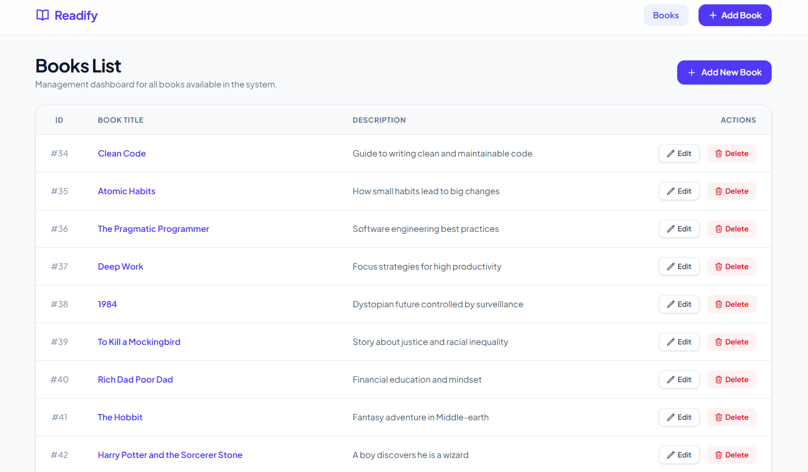
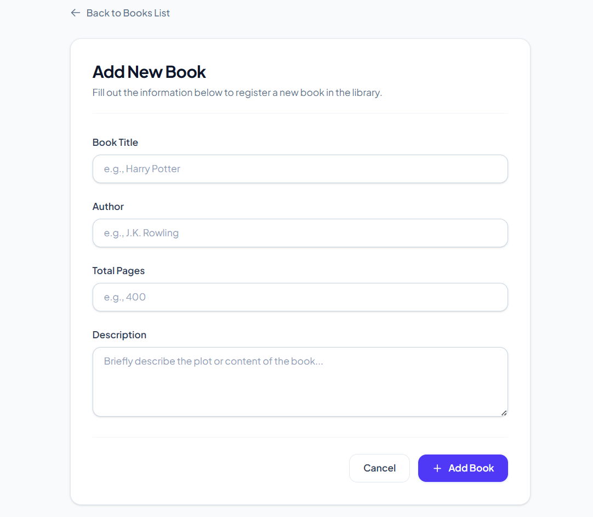
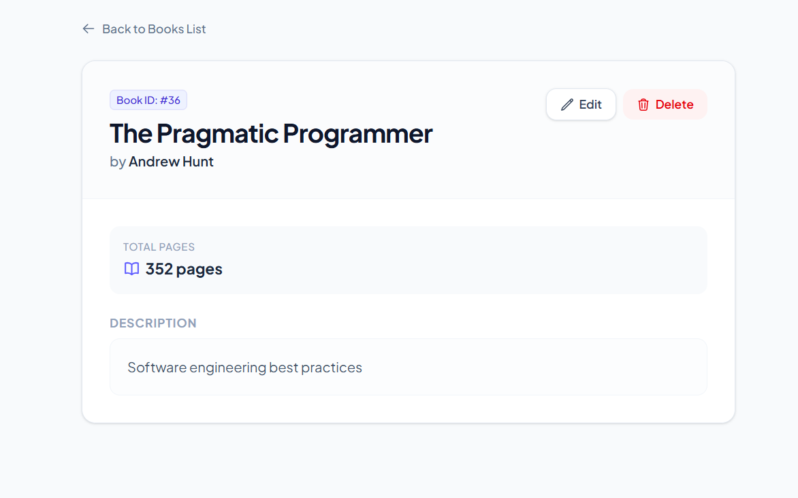

# 📚 Readify — Book Management System

**Readify** is a clean, modern, and minimalist web application designed to manage a personal digital library. Built using **Laravel**, **Tailwind CSS**, and **SQL**, the platform offers a fully structured dashboard to handle books, track their page counts, and maintain detailed descriptions through a seamless user interface.

---

## 🛠️ Tech Stack

* **Backend Framework:** Laravel (PHP)
* **Frontend Styles:** Tailwind CSS
* **Database:** SQL (MySQL / PostgreSQL)
* **Architecture:** MVC (Model-View-Controller)

---

## 🚀 Key Features

* 📊 **Management Dashboard:** A comprehensive, clean table layout tracking book database IDs, titles, and summaries.
* ➕ **Dynamic CRUD Operations:** Easily add new entries, edit existing records, or remove items securely from the system.
* 📖 **Detailed Book Views:** Dedicated view pages showcasing specific metadata such as unique Book IDs, Author names, and Total Pages (`Total Pages` counter block).
* 🎨 **Minimalist UI/UX:** Styled using modern, desaturated violet accent tokens, custom interactive states, and clean form layouts built with Tailwind CSS.

---

## 📷 Screenshots

### 🏠 Books List Dashboard
The main interface displaying the structured inventory list along with inline management actions.

### ➕ Add New Book Form
A carefully padded, focus-interactive input form designed for seamless collection registry.

### 📖 Book Details View
A clear, isolated metadata screen presenting comprehensive profiles for individual books.

---

